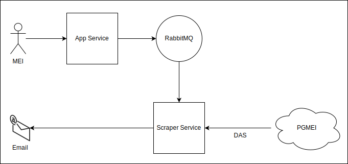

# App Service - Dev Challenge

This project is part of a solution for a Dev Challenge that consists creating a system to allow MEIs to receive their DAS directly by email.

The entire solution systems are:
 
- App Service: Provides a REST API to receive MEI and DAS information. The received data is then forwarded to the Scraper Service through RabbitMQ."
- [Scraper Service](https://github.com/sesaquecruz/dev-challenge-scraper-service): Retrieves the data from RabbitMQ, scrapes the DAS from the PGMEI site, and then sends it by email.

<p align="center">
  
</p>

## API

### Endpoints

| Endpoint       | Method | Description         |
|----------------|--------|---------------------|
| `/api/v1/das`  | POST   | Request a DAS       |
| `/api/v1/docs` | GET    | API's documentation |

### Data Format

- POST to `/api/v1/das`

```
{
  "cnpj": "66.516.671/0001-18",
  "email": "user@mail.com",
  "year": 2024,
  "month": 1
}
```

The CNPJ can be passed in either of the following formats: `66.516.671/0001-18` or `66516671000118`.

## Installation

1. Clone this repository:

```
git clone https://github.com/sesaquecruz/dev-challenge-app-service
```

2. Enter the project directory:

```
cd dev-challenge-app-service
```

3. Run the docker compose to start the infrastructure services:

```
docker compose --profile infra up -d
```

4. Run the docker compose to start the application service:

```
docker compose --profile prod up -d --build
```

To stop all services, run: `docker compose --profile infra --profile prod down`.

## Usage

1. Access the API's documentation:

```
http://localhost:8080/api/v1/docs/
```

## Contributing

Contributions are welcome! If you find a bug or would like to suggest an enhancement, please make a fork, create a new branch with the bugfix or feature, and submit a pull request.

## License

This project is licensed under the MIT License. See [LICENSE](./LICENSE) file for more information.
